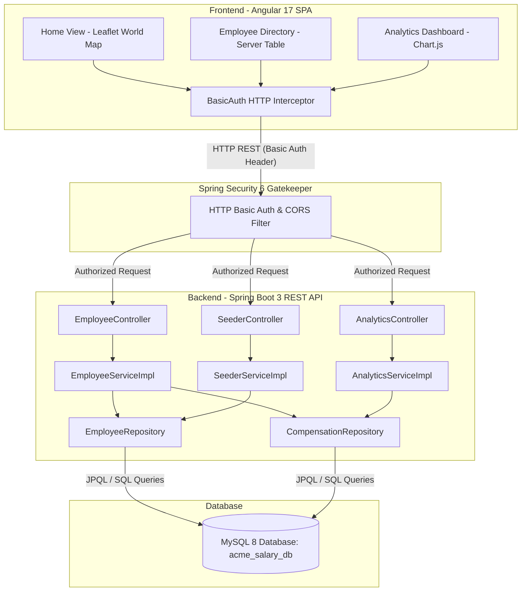
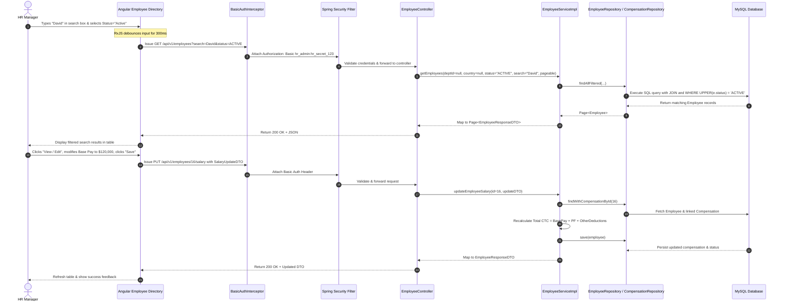
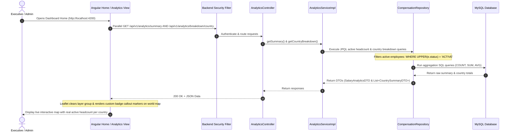
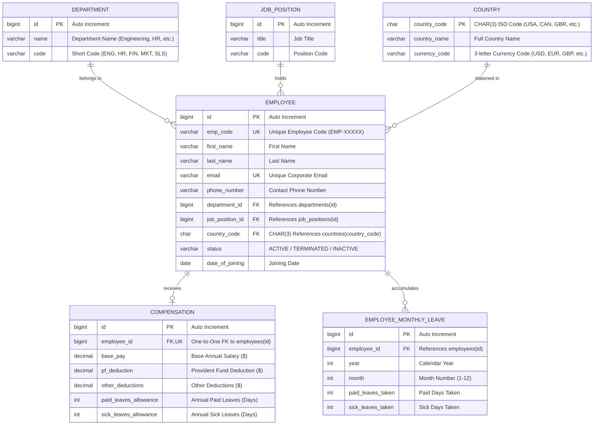

# ACME Salary Management System - Master Architecture Specification

Welcome to the master architectural documentation for the **ACME Salary Management System**. This comprehensive guide details the design, end-to-end data flows, backend services, frontend user interface, security model, data structures, and operational workflows of the platform.

---

## 1. Executive Summary & Plain-English Overview

> 💡 **For Non-Technical Stakeholders & HR Executives**:
> 
> Imagine a **global corporation** with 10,000 employees working across 10 countries (USA, Canada, UK, Germany, France, India, Australia, Japan, Singapore, Brazil). Managing salaries, bonuses, tax deductions, and regional payroll budgets across multiple currencies and departments manually is nearly impossible.
> 
> The **ACME Salary Management System** acts as a **smart digital command center**:
> 
> 1. **The Front Desk (Frontend UI)**: A sleek, interactive web console where HR managers can search for any employee in milliseconds, update salary structures, view interactive world maps showing active headcount per country, and explore visual financial charts.
> 2. **The Processing Engine (Backend API)**: A high-speed administrative server built with Java that verifies every request, enforces company payroll rules, and ensures numbers balance perfectly.
> 3. **The Central Vault (Database)**: A secure, structured database storing all employee contracts, department records, and compensation metrics.
> 4. **The Security Guard (Spring Security)**: An automated security barrier ensuring only authenticated HR administrators with valid credentials (`hr_admin`) can access confidential salary data.

---

## 2. End-to-End System Architecture

The platform follows a modern, decoupled **Client-Server Architecture** communicating over secure JSON REST APIs.



### Full Technology Stack Table

| Layer | Component / Technology | Specification & Role |
| :--- | :--- | :--- |
| **Frontend Framework** | Angular 17.3 | Component-driven Single Page Application using Standalone Components. |
| **Frontend State & Reactive** | RxJS 7.8 | Reactive data streams with debouncing (`debounceTime`), request cancellation (`switchMap`), and event broadcasting (`BehaviorSubject`). |
| **Mapping Engine** | Leaflet.js 1.9 | GIS World Map rendering CartoDB Dark Voyager basemap tiles with custom callout badges. |
| **Charting Engine** | Chart.js 4 & ng2-charts 5 | Interactive departmental compensation bar charts, country distribution pie charts, and salary histograms. |
| **UI Design System** | TailwindCSS 3 & PrimeNG Lara Dark | Custom dark-mode aesthetic with glassmorphism overlays and responsive grid layouts. |
| **Backend Framework** | Spring Boot 3.2.5 (Java 17) | Enterprise REST API server built on Java 17 features (records, text blocks, pattern matching). |
| **Security Layer** | Spring Security 6 | HTTP Basic Authentication, CORS policies, and role-based access control (`ROLE_HR`). |
| **ORM & Persistence** | Spring Data JPA & Hibernate 6 | Relational data mapping with JPA criteria queries, custom JPQL aggregations, and entity graphs. |
| **Database Engine** | MySQL 8.0 | Relational storage database running on `acme_salary_db` with index optimizations. |

---

## 3. End-to-End User Journeys & Request Flows

### User Journey A: HR Manager Searches & Updates Employee Salary



---

### User Journey B: Executive Views Global Headcount Map & Analytics



---

## 4. Entity Relationship & Data Model Specification

The database model is normalized to Third Normal Form (3NF) to guarantee data integrity across departments, positions, countries, and compensation records.



---

## 5. Security & Authentication Architecture

Security is enforced at both frontend and backend boundaries:

1. **Frontend Credential Handling**:
   - `BasicAuthInterceptor` automatically injects HTTP Basic Credentials into every outgoing HTTP request header:
     $$\text{Authorization: Basic } \text{Base64}(\text{"hr\_admin:hr\_secret\_123"})$$
2. **Backend Spring Security Enforcement**:
   - Configured in `SecurityConfig.java`.
   - Protects all `/api/v1/**` endpoints.
   - Unauthenticated requests receive `401 Unauthorized`.
   - Cross-Origin Resource Sharing (CORS) is configured to permit `http://localhost:4200`.

---

## 6. High-Volume Batch Data Seeding (10,000 Records)

To support performance testing across enterprise-scale data sets, the backend includes an optimized bulk seeder (`SeederServiceImpl.java`):

- **Algorithm**: Generates 10,000 employees distributed randomly across 5 departments, 10 job positions, and 10 operating countries.
- **Realistic Salary Distribution**: Generates salary values adhering to Gaussian normal distribution benchmarks centered around $100,000 base pay.
- **Batch Processing Optimization**: Uses Hibernate batching (`spring.jpa.properties.hibernate.jdbc.batch_size=500`). The service processes records in chunks of 500, explicitly invoking `entityManager.flush()` and `entityManager.clear()` after each batch to prevent Java heap memory exhaustion.

---

## 7. Operational & Setup Guide

### 1. Prerequisites
- **Java Development Kit (JDK)**: OpenJDK 17 or 19
- **Node.js**: Node v18+ and npm
- **Database**: MySQL Server 8.0 running on `localhost:3306` with database name `acme_salary_db`

### 2. Running the Backend Server
```powershell
cd "d:\Salary Management System\salary-management-backend"
$env:JAVA_HOME = "C:\Users\ankit\.jdks\openjdk-19.0.2"
.\mvnw.cmd spring-boot:run
```
The backend API will start at `http://localhost:8080`.

### 3. Running the Frontend UI
```powershell
cd "d:\Salary Management System\salary-management-frontend"
npm start
```
The Angular UI will start at `http://localhost:4200`.

---

## 8. Summary of Component Files

| Project | File Path | Description |
| :--- | :--- | :--- |
| **Backend** | `src/main/java/.../entity/Employee.java` | Main Employee JPA Entity with annotations and relationships. |
| **Backend** | `src/main/java/.../entity/Compensation.java` | Compensation breakdown JPA Entity linked to Employee. |
| **Backend** | `src/main/java/.../dto/CountrySummaryDTO.java` | Regional headcount and salary summary record with constructor handling. |
| **Backend** | `src/main/java/.../repository/CompensationRepository.java` | Analytics JPQL queries with active employee status filtering. |
| **Backend** | `src/main/java/.../service/impl/SeederServiceImpl.java` | High-performance 10k batch database seeder implementation. |
| **Frontend** | `src/app/features/home/home.component.ts` | Executive homepage featuring Leaflet GIS map & stat overlay cards. |
| **Frontend** | `src/app/features/employee-directory/employee-directory.component.ts` | Employee directory data table with debounced search and edit modal. |
| **Frontend** | `src/app/features/analytics/analytics-dashboard.component.ts` | Financial charts dashboard powered by ng2-charts / Chart.js. |
| **Frontend** | `src/app/core/interceptors/basic-auth.interceptor.ts` | HTTP Basic Auth credential injection interceptor. |
